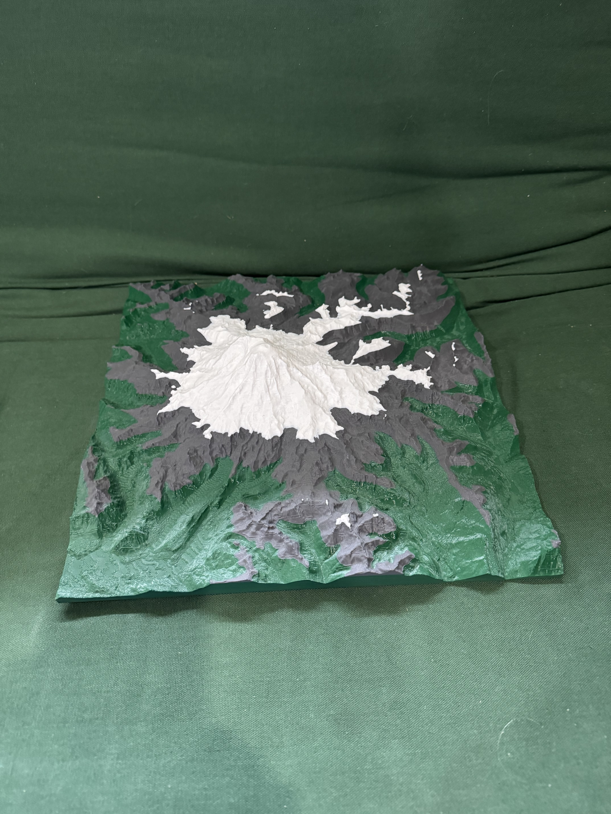
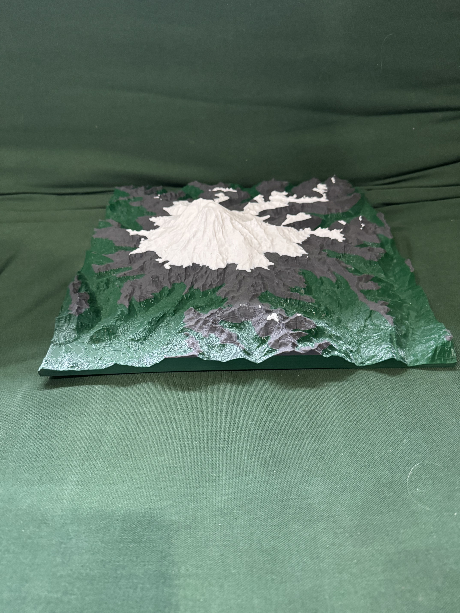
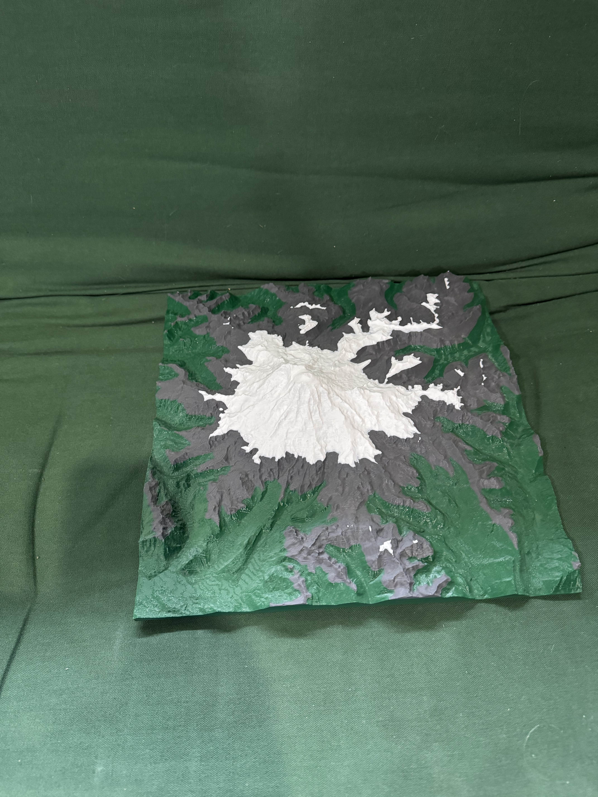
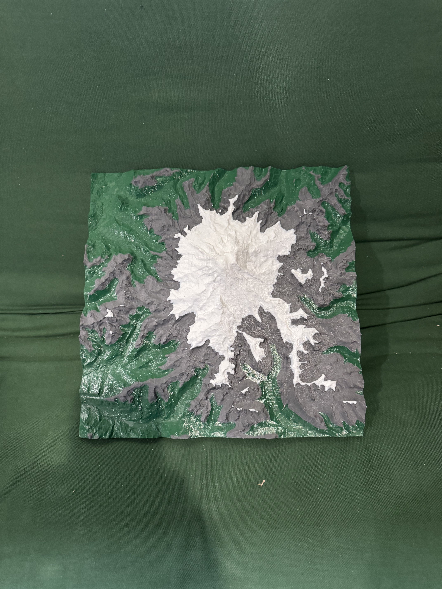
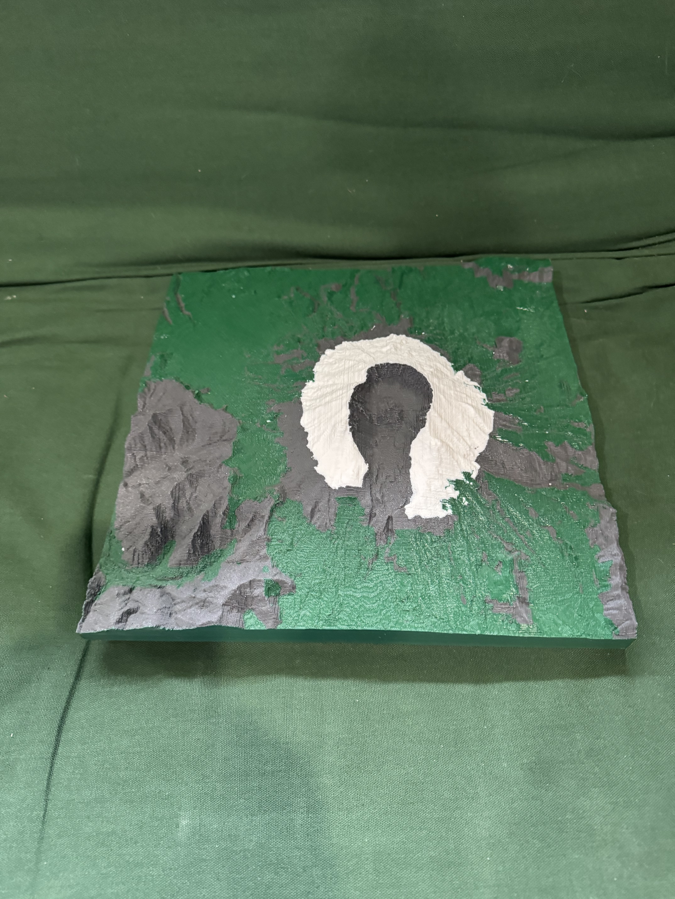
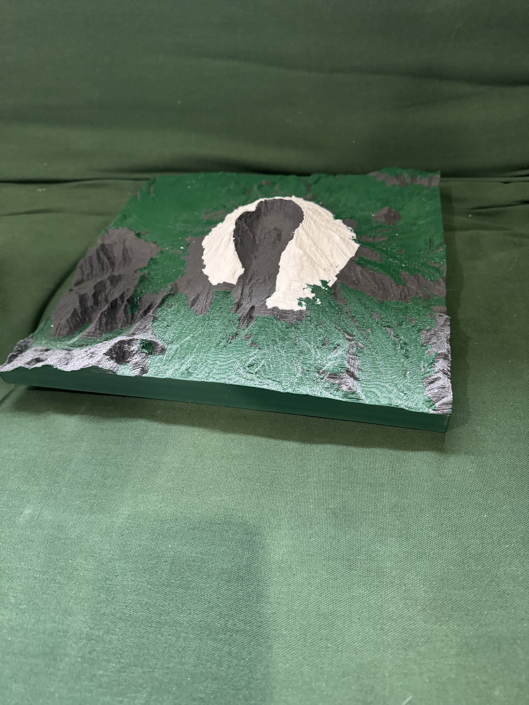
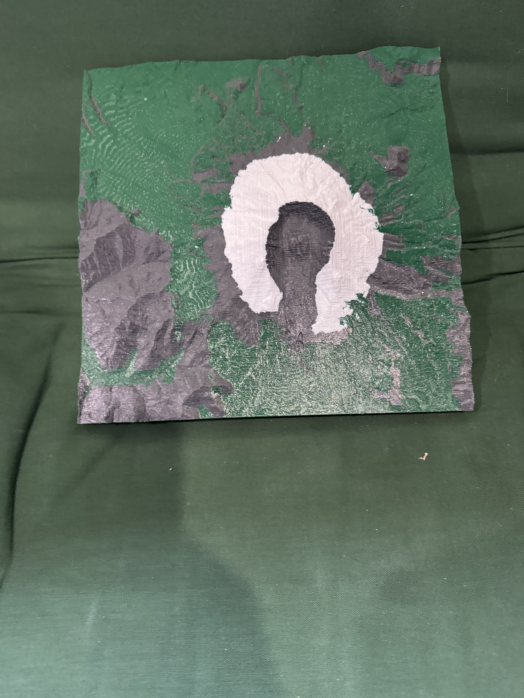
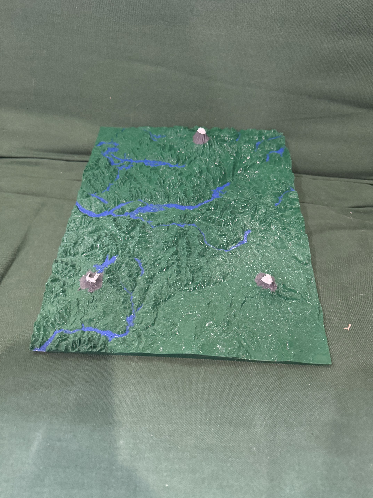
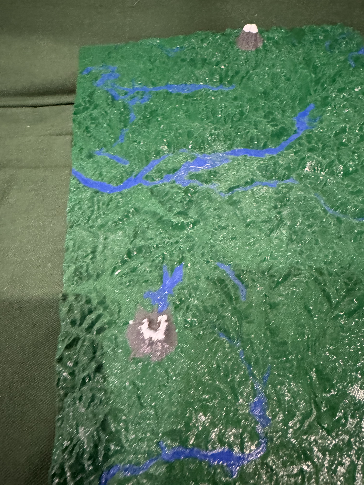
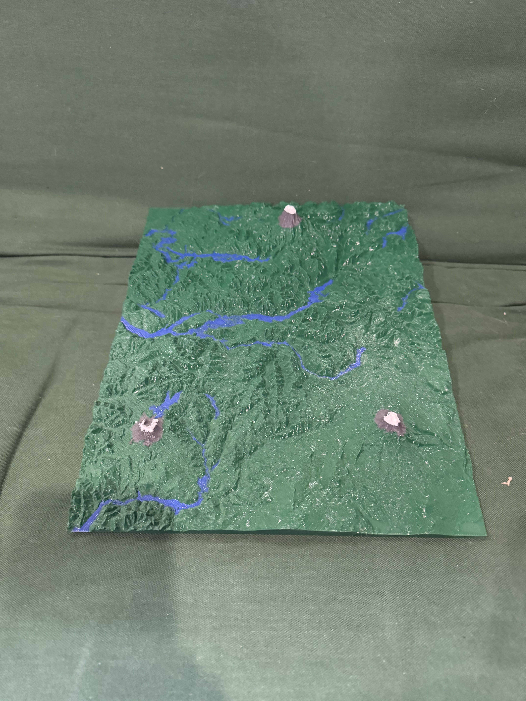

# PyTerrainModeler

PyTerrainModeler is a tool for generating 3D-printable STL files from real world terrain elevation data. It allows users to create detailed physical models of landscapes, mountains, and coastal areas by processing MapZen/Open TOPO data or NOAA XYZ files.

### Example Prints
Here are some examples of models generated and printed using PyTerrainModeler:

|  |  |  |
| :---: | :---: | :---: |
|  |  |  |
|  |  |  |
|  | | |

Warning:
  These instructions are known to work on Ubuntu and Windows systems. It's an outline for getting this to work
  not a map or a guide. I am, after all, Unintelligible Maker.

  Note for Windows users: If you see an error that `python.exe` cannot find the specified path, use the Python Launcher `py` instead (e.g., `py ./bin/Rainier.py`).

Setup:
* Get the code
  * Install git:\
    `sudo apt install git-all`
  * Pull the code:\
    `git clone https://github.com/UnintelligibleMaker/PyTerrainModeler.git`\
    `cd PyTerrainModeler`
* Get Map Data:
  * install awscli
     - Older systems use:\
      `sudo apt install awscli`
    - Newer ones use:\
      `sudo snap install aws-cli --classic`
  - Make dir and move into it\
    `mkdir MapZen`\
    `cd MapZen`
  - fetch map data into the new MapZen directory\
  Note: This is ~200GB of data.  It's from MapZen/Open TOPO.  This is their recommended download procedure.  https://www.opentopodata.org/datasets/mapzen/ I used this as it's free.\
    `aws s3 cp --no-sign-request --recursive s3://elevation-tiles-prod/skadi ./`

* Install Dependencies:
  - Install the package in editable mode (recommended):\
    `pip install -e .`
  - Or install dependencies manually:
    - GeoPy\
      `pip install geopy`
    - numpy-stl\
      `pip install numpy-stl`

* Building an example model \
  All these examples generate a `terrain.stl` file in the local directory that you can open in Cura and PrusaSlicer.
  - Mount Rainier
    - Dry run/Draft: lower res/quicker. I use this mode when changing other settings and tuning them to a good model
      `python ./bin/Rainier.py -n`
    - Full Quality. This will take a while.
      `python ./bin/Rainier.py`
  - Other Examples:
    - `python "./bin/King&Peirce.py"`
    - `python "./bin/Lake Washington.py"`
    - `python "./bin/Yosemite.py"`
    - `python "./bin/Italy.py"`
    - `python "./bin/Mauna Kea.py"`

* Building your own model - The Options
  - latitude: This is the latitude of the South West corner of the area to be modeled.  Float -90.0 - 90.0
  - longitude: This is the longitude of the South West corner of the area to be modeled.  Float -180.0 - 180.0
  - longitude_size: This is the size (length) of the south edge of the map in longitude. Float.
  - size_x: size of the model's x-axis. Technically unitless but usually mm.
  - size_y: size of the model's y-axis. Technically unitless but usually mm.
  - steps_x: number of steps in x direction. This and the size_x determine the model's resolution in the x direction.
  - steps_y: number of steps in y direction. This and the size_y determine the model's resolution in the y direction.
  - scale_z: factor by which to increase the scale in the z direction. This is often needed on larger models to accentuate features that would otherwise be flat.
  - offset_elevation: offset of the elevation for the bottom of the model. If your map is a long way above sea level or extends below sea level, you can use this to push the "0" elevation of sea level up or down in the model. Note in the `Yosemite.py` example I set the offset to 1000m which is just below the valley floor. This makes the bottom of the model thinner. In the `King&Peirce.py` I use -400m to raise sea level on the model and include the Puget Sound Shipping channel's depth above the bottom of the model. Float in meters.
  - min_allowed_z: minimum allowed z forces the model to have a minimum thickness in the z height. This does not move the model...it just fills in by moving any point lower than this to this level. I've used this to model "what if" rises in sea level. Float in unitless (usually mm) on the model.
  - Flattening options:
    The flattening option serves dual purposes.
    First, it allows some "squishing" on the extreme highs and lows on the model towards a reference elevation.
    This is useful, especially if your model has flatter areas you want to use `scale_z` on but also lower/higher areas that this makes too high.
    This exponentially squishes the model to help remove that.
    You can see this in the `King&Peirce.py` where I use 0.9 to make the mountains not so extra tall looking.
    The other usage here is that in the small scale, within a meter of the reference elevation is pushed out towards the meter...further accentuating features at this specific height.
    So in the case of the `King&Peirce.py` I was trying to get Lake Washington and Mercer Island to look right...so by setting the reference height at the surface of the lake I make the outline clearer.
    Note that I only flatten in the positive direction in that example to leave the shipping channel more dramatic looking.
    - flatten_reference_elevation_meters: flatten reference elevation in meters.
    - flatten_factor: flatten factor to logarithmically flatten by. 0.6 - 0.98 usually.
    - flatten_mode: flatten mode - Can be `None`, `FlattenMode.POSITIVE` (above the reference), `FlattenMode.NEGATIVE` (below the reference) or `FlattenMode.BOTH`.
  - hgt_gz_folder: The folder where the `hgt.gz` files are stored. See above for how to get these. The script will only open the ones needed so you can try to only have the ones you need...but I just keep the whole cache on my drive.
  - xyz_config: The XYZ Config for NOAA XYZ files.
                `{surface elevation: [file, file, file, ... ], surface elevation: [file, file, file, ... ] ...}`
  - xyz_units: units of the depth in the XYZ files. Can be `'feet'` or `'meters'`. Default is `'feet'`.
  - max_processes: The maximum number of processes to have running at a time.
    In most cases the default `os.cpu_count() * 2` is good.
    Fair warning `1` is mostly for debug, so it forces some things to not be parallelized.
    I do not recommend `1` unless you are debugging PyTerrainModeler itself.
    For example, I ran a ton of runs at `1` in a debugger to get all the triangles facing the right directions (in vs. out).
    I do not recommend `1` even if you know what you are doing unless you really need it.
    
  In general, for me, making a model is an iterative process.
    I get the latitude, longitude, and longitude_size from any online mapping program (I use Google Maps, but any will do).
    The size_x and size_y are how big I want the model on the printer, and I usually know.
    I start with low steps_x and steps_y to keep the iteration time low.
    The offset_elevation, scale_z, flatten_reference_elevation_meters, flatten_factor, and flatten_mode are the options I iterate on changing until the model looks right.
    Then I set the steps_x and steps_y to get a detailed model. 

* STL?  What's that?\
  An STL file is a 3d model that's commonly used for 3D printing or CNC machining.  I am not an expert on them and based this work mostly on my knowledge of 3D graphics from working on the hardware in a former job.  I just push the data into an STL as that's easy.  More info about STLs: https://www.adobe.com/creativecloud/file-types/image/vector/stl-file.html
  
* Model Errors
  - If a model has a hole in it, meaning there are places of 0 z-height that are omitted from the model, it can create a "model" that is not totally connected as one object...but an STL has only one object.  So mine ends up somewhat deformed, but eh both Cura and PrusaSlicer open and slice them.
  - Sometimes (though it's rare now) a triangle faces the wrong way (in vs out of the model).  There are bugs that I hope are getting rarer.  I'm good with righty-tighty / lefty-loosey even when rotated backwards but not as good with clockwise and anti-clockwise when rotated backwards. Most slicers will be OK with this, though some will point out the model errors.  I ignore them and let the slicers deal with it but that's just me, Unintelligible Maker.
